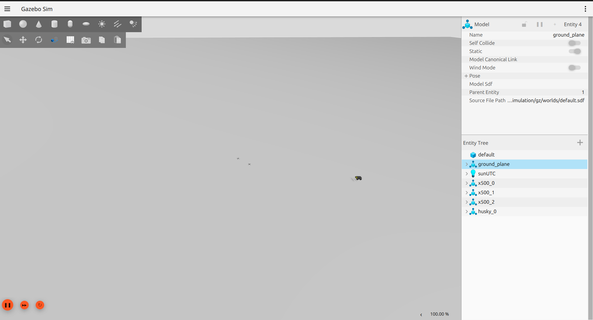

# Event-Triggered Distributed Spatial Memory for Heterogeneous UAV–UGV Teams

**Research areas:** Swarm robotics, heterogeneous multi-robot systems, digital pheromones, event-triggered communication, distributed autonomy

This repository presents a ROS 2, PX4, and Gazebo research prototype for communication-efficient coordination between aerial and ground robots.

Three UAVs act as scouts in a cluttered disaster/industrial environment. They patrol assigned sectors, identify mission-relevant targets, and selectively deposit digital pheromone information into a persistent spatial field. A Husky UGV follows this field, approaches candidate targets, performs close-range verification, and clears verified regions.

The robots coordinate through persistent spatial information rather than direct UAV-to-UGV motion commands.

---

## Research Question

Under what event-triggering conditions should heterogeneous robots create, update, and communicate persistent spatial information while preserving effective coordination under limited, intermittent, or degraded communication?

---

## Coordination Pipeline

```text
UAV patrol and perception
        ↓
Spatial target observation
        ↓
Event-trigger evaluation
        ↓
Digital pheromone deposit
        ↓
Persistent spatial field
        ↓
UGV field-following navigation
        ↓
Ground target verification
        ↓
Pheromone clearing or continued reinforcement
```

The digital pheromone field is interpreted as a form of distributed spatial memory.

---

## Current System

The integrated simulation currently includes:

- three PX4 x500 UAVs
- one Husky UGV
- ROS 2 Jazzy
- PX4 SITL
- Gazebo
- disaster/industrial simulation world
- sector-based UAV patrol
- event-triggered pheromone deposition
- pheromone diffusion and decay
- pheromone age and staleness measurement
- UGV field-following navigation
- target detection
- ground target verification
- pheromone clearing after verification
- CSV and JSONL experiment logging
- scalability experiment scripts
- simulated UAV-failure experiment scripts



---

## System Architecture

```text
UAV patrol and target observation
              ↓
Event-triggered deposit decision
       ┌──────┴────────┐
       │               │
 Transmit deposit   Suppress update
       │               │
       ↓               ↓
 /pheromone_deposit   Saving counter
       │
       ↓
 Pheromone manager
       ├── /pheromone_map
       ├── /pheromone_staleness_map
       └── field metrics
       │
       ↓
 Husky field-following controller
       │
       ↓
 Target verification
       │
       ↓
 /pheromone_clear
```

---

## Main ROS 2 Interfaces

| Interface | Purpose |
|---|---|
| `/pheromone_deposit` | Event-triggered spatial-information deposits |
| `/pheromone_map` | Current pheromone concentration field |
| `/pheromone_staleness_map` | Age and staleness of active field information |
| `/pheromone_clear` | Clearing request after target verification |
| `/husky_0/cmd_vel` | Husky UGV motion command |

---

## Verified Integrated Results

Three recent complete research-stack trials produced the following results:

| Run | Duration | Detected | Verified | Deposits | Suppressed updates | Saving |
|---|---:|---:|---:|---:|---:|---:|
| `run_20260625_200147` | 176 s | 3 | 2 | 1,639 | 23,801 | **93.56%** |
| `run_20260625_200545` | 544 s | 3 | 2 | 4,356 | 76,536 | **94.62%** |
| `run_20260625_201641` | 742 s | 3 | 2 | 5,445 | 105,501 | **95.09%** |

The saving percentage is calculated as:

```text
saving =
suppressed candidate updates
──────────────────────────────────────── × 100
transmitted deposits + suppressed updates
```

This measures event-triggered message suppression. It does not yet represent measured network bytes, radio airtime, or energy consumption.

The complete retained CSV summaries are available in:

```text
results/integrated_runs/
```

---

## Research Nodes

| Node | Function |
|---|---|
| `swarm_patrol_research.py` | UAV sector patrol |
| `drone_depositor_research.py` | Observation processing and event-triggered deposition |
| `pheromone_manager_research.py` | Field maintenance, decay, clearing, age, and staleness |
| `husky_forager_research.py` | UGV pheromone-field following |
| `target_verifier_research.py` | Ground target verification and field clearing |
| `metrics_logger_research.py` | Mission and communication metric logging |
| `scenario_utils.py` | Scenario configuration loading |

Source files are located in:

```text
src/research_nodes/
```

---

## Repository Structure

```text
.
├── assets/                  Simulation screenshots
├── config/                  Disaster scenario configuration
├── docs/                    Architecture and runtime documentation
├── experiments/             Scalability and robustness experiments
├── results/
│   └── integrated_runs/     Retained time-series summaries
├── src/
│   └── research_nodes/      Current ROS 2 research nodes
├── videos/                  Runtime demonstrations
└── worlds/                  Gazebo disaster/industrial world
```

---

## Experiments

### Integrated Mission

The current integrated mission evaluates:

- target detection
- target verification
- transmitted pheromone deposits
- suppressed candidate updates
- active pheromone cells
- mean field staleness
- maximum field staleness
- field-clearing events

### Scalability

`experiments/experiment_3_scalability.py` supports tests with 3, 6, 9, and 12 agents.

A refreshed controlled dataset will be published before making a definitive 12-agent performance claim.

### Robustness

`experiments/experiment_4_robustness.py` evaluates coordination following simulated UAV failure.

A refreshed controlled dataset will be published before making a definitive quantified failure-resilience claim.

---

## Current Limitations

- The current field is maintained through a shared ROS 2 representation.
- Independent robot-local pheromone fields are not yet implemented.
- Verification currently uses simulation ground truth.
- The saving metric counts suppressed updates rather than transmitted bytes.
- Physical UAV–UGV validation has not yet been completed.
- Controlled packet-loss and communication-delay experiments remain future work.

---

## Research Roadmap

1. Independent robot-local spatial fields
2. Selective field-delta exchange
3. Delayed, duplicated, stale, and contradictory update handling
4. Confidence-aware and uncertainty-aware trigger policies
5. Packet-loss and intermittent-connectivity experiments
6. Continuous and periodic communication baselines
7. Refreshed scalability and UAV-failure datasets
8. Stronger UGV obstacle-aware navigation
9. Physical UAV–UGV validation
10. Formal communication-performance analysis

---

## Runtime Evidence

The repository contains:

- Gazebo simulation screenshots
- multi-UAV and Husky runtime videos
- active pheromone-field demonstrations
- retained experiment summaries
- stable earlier proof tag: `v0.1-runtime-proof`

---

## Author

**Oluwagbotemi Ogundipe**

Research interests: swarm robotics, distributed autonomy, bio-inspired coordination, event-triggered control, and heterogeneous UAV–UGV systems.

GitHub: https://github.com/Gbotemi11
