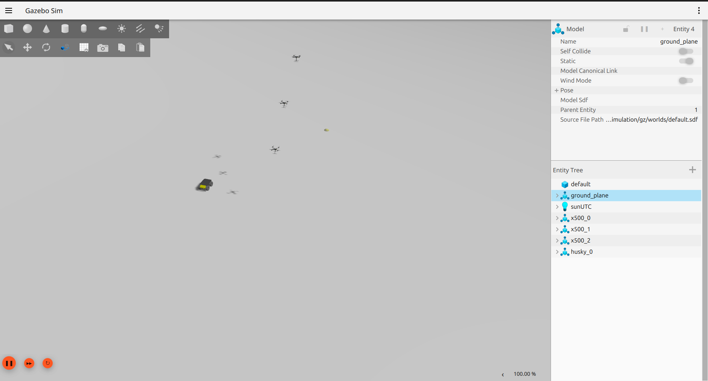

# Event-Triggered Stigmergic Coordination for Heterogeneous UAV–UGV Swarms

**Author:** Oluwagbotemi Elijah Ogundipe  
**Status:** Early-stage research manuscript in preparation  
**Focus:** Swarm robotics, UAV–UGV coordination, event-triggered communication, communication-efficient multi-robot autonomy

---

## Overview

This repository presents a public, non-confidential overview of an early-stage swarm robotics research project on communication-efficient coordination for heterogeneous UAV–UGV teams.

The project investigates how aerial robots can support ground robot navigation through indirect digital environmental signalling instead of continuous state broadcasting.

The work is currently implemented in simulation using ROS 2 Jazzy, PX4, and Gazebo.

---

## Research Motivation

Large robot teams often depend on frequent communication between agents. This can become unreliable or expensive in communication-constrained, uncertain, or dynamic environments.

This project explores an alternative approach inspired by stigmergy, where agents coordinate indirectly through traces left in the environment.

---

## Core Research Idea

Instead of continuous communication, UAVs communicate only when relevant events occur. The UGV does not receive direct commands from the UAVs. Instead, it follows information encoded in a shared guidance field.

This approach aims to support:

- reduced communication load
- decentralized UAV–UGV coordination
- scalable swarm behavior
- robustness under agent failure
- safety-aware multi-agent operation

---

## System Architecture

A high-level architecture diagram is available here:

[System Architecture](docs/system_architecture.md)

---

## Simulation Screenshot

The current Gazebo simulation setup includes three UAV agents and one Husky UGV.

---

## Current Simulation Setup

The current simulation study uses:

- ROS 2 Jazzy
- PX4
- Gazebo
- multiple UAV agents
- one Clearpath Husky UGV
- shared digital guidance layer
- event-triggered updates
- safety-aware coordination using control barrier function concepts

---

## Preliminary Experimental Results

The current simulation study includes four controlled experiments:

| Experiment | Purpose |
|---|---|
| Communication reduction | Compare event-triggered communication against continuous broadcasting |
| Task completion | Evaluate UGV guidance compared with unguided behavior |
| Scalability | Test behavior with larger agent teams |
| Robustness | Evaluate swarm behavior under UAV failure |

Preliminary results suggest that event-triggered stigmergic coordination can substantially reduce communication compared with continuous broadcasting while still providing useful guidance for the ground robot.

The full manuscript contains detailed quantitative results and is currently in preparation.
A non-confidential preliminary results summary is available here:

[Preliminary Simulation Results](results/preliminary_results.md)

---

## Related UGV Platform Work

In parallel, I am building an edge-device-based custom UGV platform for visual-inertial sensing and future autonomous navigation research.

The current platform includes:

- two CSI cameras
- IMU connected through a USB serial bridge
- ROS 2 Jazzy sensor integration
- calibrated IMU publishing to /imu/data
- dual-camera ROS topic publishing
- synchronized ROS bag recording
- health-check, logging, calibration, and startup scripts

This hardware work supports the longer-term goal of moving from simulation-only UAV–UGV coordination toward real-world robot deployment.

---

## Planned Extensions

Planned next steps include:

- improving theoretical analysis of the event-triggered coordination mechanism
- comparing against additional decentralized coordination baselines
- preparing a conference submission
- creating simulation videos and visual result summaries
- extending toward hardware-oriented validation
- exploring semantic and dynamic SLAM for UGV navigation in changing environments

---

## Repository Contents

assets/    Images, diagrams, screenshots, and architecture figures  
docs/      Public research summaries and non-confidential documents  
results/   Result tables, plots, and experiment summaries  
videos/    Simulation videos or demo links  

---

## Current Disclosure Status

This repository is a public research overview. Full implementation details, source code, and the complete manuscript are currently private while the work is being prepared for academic submission.

A public preprint or submitted manuscript link will be added when available.

---

## Contact

**Oluwagbotemi Elijah Ogundipe**  
B.Eng. Mechatronics Engineering  
Email: oluwagbotemi6ogundipe@gmail.com
