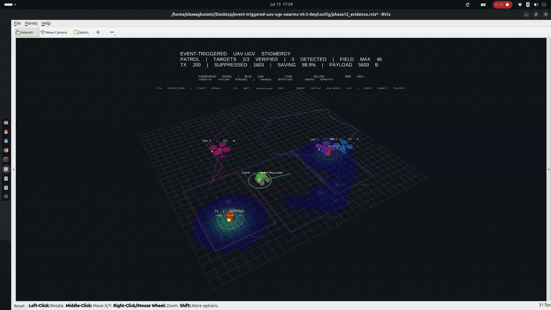
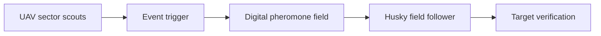

# Event-Triggered UAV–UGV Swarm Evidence

<!-- PHASE12_GIF_START -->

*Three PX4 UAVs generate an event-triggered digital pheromone field while a Husky UGV follows the field to verify targets. Click the preview for the full 1080p evidence video.*

<!-- PHASE12_GIF_END -->

Public evidence for research on communication-efficient persistent monitoring
with heterogeneous UAV–UGV teams.

> **Research question:** Can event-triggered stigmergic UAV–UGV coordination
> reduce serialized pheromone payload while preserving search and
> target-verification performance relative to continuous communication, and
> how does it compare with a secondary periodic sensing-and-deposition benchmark?

**[Watch the 66.8-second 1080p demonstration](videos/phase12_event_triggered_uav_ugv_rviz_demo.mp4)**

## Coordination mechanism

The UAVs do not issue direct commands to the UGV. They update a shared spatial
field, while the Husky reads that field and selects its own motion. In the
event-triggered policy, transmission occurs only when the event rule admits an
update. Continuous transmission and periodic sensing-and-deposition were
evaluated as comparison policies.

## Validated demonstration result

| Metric | Result |
|---|---:|
| Target verification | 3/3 |
| Canonical duration | 124.074 s |
| Transmitted deposits | 954 |
| Policy-suppressed updates | 1,636 |
| Candidate-update suppression | 63.17% |
| Serialized pheromone payload | 26,712 bytes |
| Accounting errors | 0 |
| Forced kills / orphan processes | 0 / 0 |

The evidence is revision-linked, checksum-verified and backed by a canonical
run record. See [the complete evidence statement](evidence/phase12_gui_demonstration.md).

## Confirmatory campaign

The prospectively frozen confirmatory analysis used 36 complete paired blocks,
giving 108 valid policy runs. All three policies completed all 36 missions.

| Policy | Completed | Payload GM | Search-time GM | Verification-time GM |
|---|---:|---:|---:|---:|
| Event-triggered | 36/36 | 25,395 B | 9.035 s | 115.648 s |
| Continuous | 36/36 | 456,823 B | 9.044 s | 114.752 s |
| Periodic benchmark | 36/36 | 48,191 B | 9.145 s | 121.551 s |

### Primary comparison: continuous communication

Relative to continuous communication, event-triggering achieved:

- a paired geometric-mean payload ratio of **0.0556**, corresponding to a
  **94.44% reduction**;
- a one-sided 97.5% upper payload ratio of **0.0573**, below the prespecified
  0.50 margin;
- one-sided 97.5% upper search- and verification-time ratios of **1.0029** and
  **1.0272**, both below the 1.10 noninferiority margin;
- 36/36 completed missions under both policies; and
- an exact one-sided event-triggered completion-probability lower bound of
  **0.9026**, above the prespecified 0.90 floor.

Event-triggering therefore passed the prospectively frozen payload, timing and
composite mission-completion acceptance criteria against continuous
communication.

### Secondary periodic benchmark

Relative to the periodic benchmark, the event-triggered payload ratio was
**0.5270**, corresponding to a **47.30% reduction**. Its one-sided 97.5% upper
ratio was **0.5424**, so it did **not** pass the prespecified 0.50 payload-ratio
criterion. Timing and mission-completion criteria passed.

The periodic result is retained as a secondary periodic
sensing-and-deposition benchmark because its observation opportunity was
coupled to its transmission period. It is not interpreted as a comparison in
which sensing opportunities were identical across all three policies.

## Observation model

UAV target observations used a deterministic, omnidirectional planar-proximity
model. A target was detected when the ground-truth planar UAV position entered
a **5.5 m** radius around the configured ground-truth target coordinate. The
model did not include camera field of view, occlusion, altitude dependence,
sensor noise, missed detections, false positives, classification error or
localization uncertainty.

An accepted observation deposited a task pheromone at the exact configured
target coordinate. Ground-truth target information was available to the UAV
observation layer, mission verifier and visualizer, but it was not supplied
directly to the UGV controller. The UGV selected navigation goals from the
pheromone field.

## Scientific boundary

The GUI run demonstrates integrated mechanism execution and evidence-lifecycle
integrity. The confirmatory campaign provides nominal simulation evidence for
communication-efficient stigmergic coordination under idealized sensing.

In the frozen implementation, event-triggered and continuous modes checked for
target observations before deciding whether to transmit a trail update.
Periodic mode checked for a target only after its transmission period elapsed.
Consequently, the periodic implementation coupled sensing opportunity to the
periodic deposition schedule and did not isolate communication admission alone.

The results do not establish robustness to realistic perception errors,
occlusion, communication loss, hardware effects or field conditions. They also
do not by themselves establish general scalability or real-world deployment
performance.

## Repository scope

This public repository intentionally contains documentation, diagrams, a
demonstration video, machine-readable demonstration evidence and a summary of
the confirmatory findings. The exact frozen implementation, experimental
configurations and complete 108-run confirmatory archive remain private and
are preserved as immutable research evidence. Access may be provided to
academic collaborators where appropriate.

Any future implementation that moves target observation ahead of the periodic
transmission gate will be preserved separately under a new branch or tag and
evaluated using a new protocol, campaign identifier and result set. It will not
silently replace the frozen campaign reported here.

## Researcher

**Oluwagbotemi Ogundipe**  
Research interests: swarm robotics, distributed autonomy, bio-inspired
coordination, event-triggered control and heterogeneous UAV–UGV systems.
