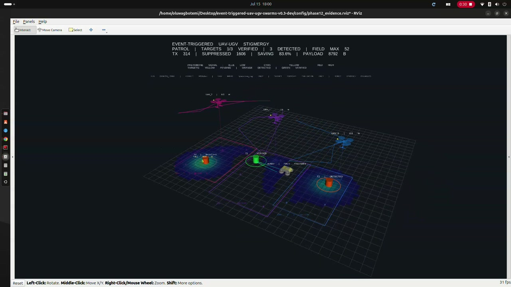
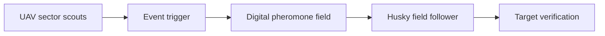

# Event-Triggered UAV–UGV Swarm Evidence

Public evidence for research on communication-efficient persistent monitoring
with heterogeneous UAV–UGV teams.

> **Research question:** Can event-triggered stigmergic UAV–UGV coordination
> reduce communication while preserving search and target-verification
> performance relative to strong continuous and periodic baselines?

**[Watch the 66.8-second 1080p demonstration](videos/phase12_event_triggered_uav_ugv_rviz_demo.mp4)**

## Coordination mechanism

The UAVs do not issue direct commands to the UGV. They update a shared spatial
field only when the communication policy triggers; the Husky reads the field
and selects its own motion.

## Validated demonstration result

| Metric | Result |
|---|---:|
| Target verification | 3/3 |
| Canonical duration | 124.074 s |
| Transmitted deposits | 954 |
| Policy-suppressed updates | 1,636 |
| Candidate-update suppression | 63.17% |
| Serialized pheromone payload | 26,712 bytes |
| Accounting errors | 0 |
| Forced kills / orphan processes | 0 / 0 |

The evidence is revision-linked, checksum-verified and backed by a canonical
run record. See [the complete evidence statement](evidence/phase12_gui_demonstration.md).

## Scientific boundary

This GUI run proves integrated mechanism execution and evidence-lifecycle
integrity. It does **not** by itself establish comparative equivalence or
superiority. Replicated synchronized headless trials for continuous, periodic
and event-triggered modes are the next experimental stage.

## Repository scope

This public repository intentionally contains documentation, diagrams, a
demonstration video and machine-readable evidence only. The unpublished
research implementation remains private. Access may be provided to academic
collaborators where appropriate.

## Researcher

**Oluwagbotemi Ogundipe**  
Research interests: swarm robotics, distributed autonomy, bio-inspired
coordination, event-triggered control and heterogeneous UAV–UGV systems.
