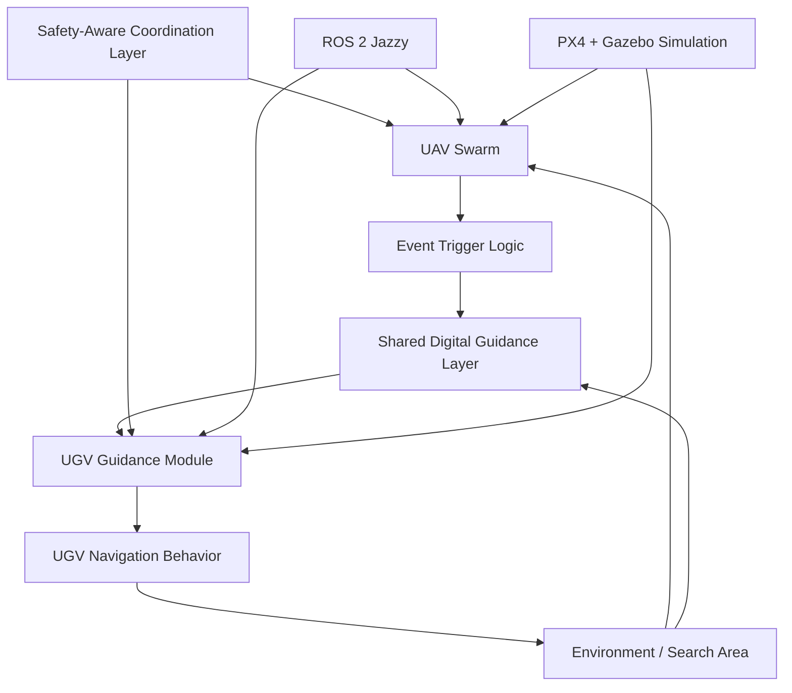

# System Architecture

This page gives a high-level, non-confidential view of the current UAV–UGV swarm coordination framework.

## Description

The system uses a heterogeneous UAV–UGV team. UAVs observe the environment and update a shared digital guidance layer only when relevant event-trigger conditions are met.

The UGV does not receive direct commands from the UAVs. Instead, it uses the shared guidance field to support navigation decisions.

## Disclosure Note

This diagram is intentionally high-level. Full implementation details, source code, parameters, and manuscript-level derivations are currently private while the work is being prepared for academic submission.
